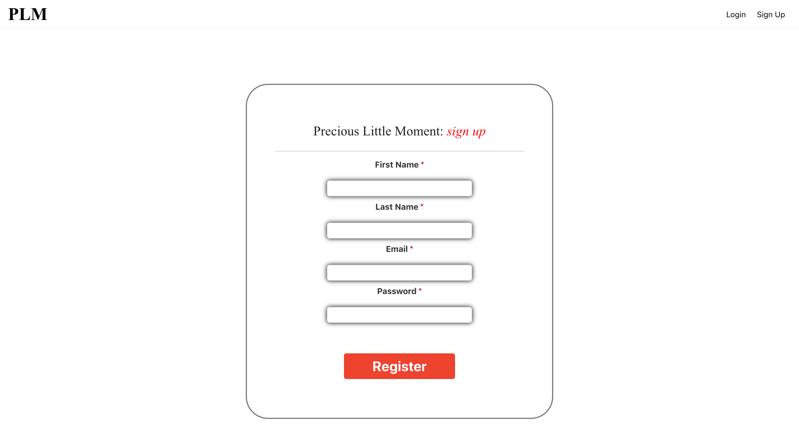
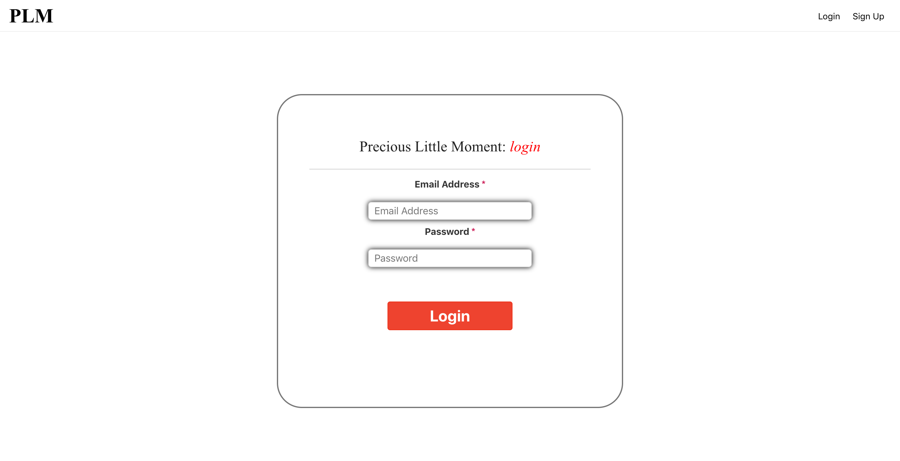
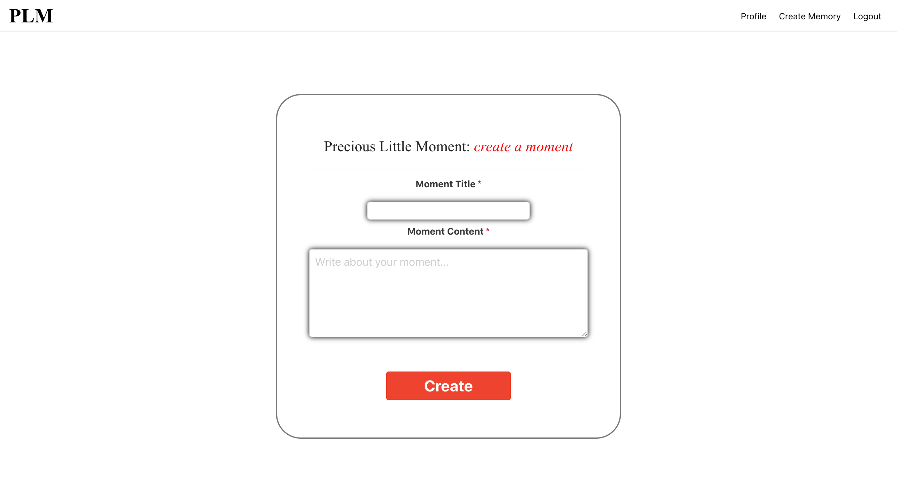

# Precious Little Moments

## Getting Started
#### Live Link: [Precious Little Moments App](https://?)
#### GitHub Repo: [Precious Little Moments Client](https://github.com/W00DH0USE/precious-little-moments/)
#### GitHub Repo: [Precious Little Moments Server](https://github.com/W00DH0USE/precious-little-moments-server/)

#### Demo Account:
#### Username: Demo_User
#### Password: Password1!

### Introduction
Precious Little Moments is an App that allows parents or guardians of children to save and share those precious moments you have of them. Look back on your time with them a year, a month, and a week ago. See how your lives have changed over time and the progress your little ones have made. Remember those moments and experiences and never forget the magic of that moment. Reading your memories is as easy as registering, logging in, writing a new entry and hitting create.







## Getting Started
### Installing
Clone the repository and download dependencies.
```
$ git clone https://github.com/W00DH0USE/precious-little-moments.git
$ cd precious-little-moments
$ npm i
```

### Launching
Start the client.
```
$ npm start
```
This will automatically open a new browser window with the project.

## Built With

 - [CSS3](https://developer.mozilla.org/en-US/docs/Web/CSS/CSS3)
 - [React](https://reactjs.org/)
 - [JWT](https://jwt.io/)